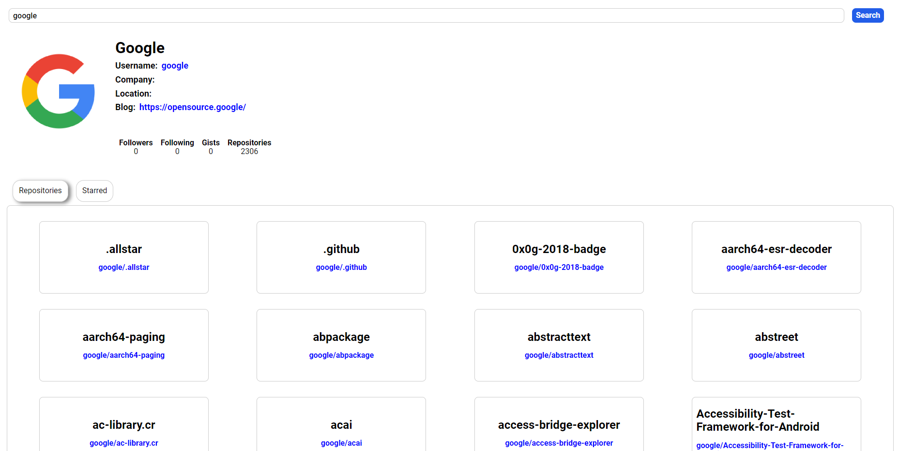

# GitHub user search through GitHub API

This project uses Axios to consume the GitHub REST API and provides a simple interface for searching GitHub users.

 

## How to use

- Simply provide a username in the input field and click "Search"
- It'll be shown the person's name, company, repositories and more.

 

## Screenshot

 

## Links

- Live Site URL: [GitHub user search through GitHub REST API](https://adrielgamorim.github.io/GitHub-user-search-through-GitHub-API/)

 

## Author

- LinkedIn - [Adriel Amorim](https://www.linkedin.com/in/adrielamorim/)